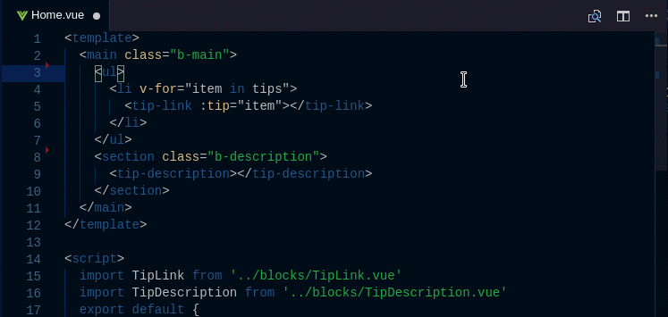

# vscode-vue-peek

This extension extends Vue code editing with `Go To Definition` and `Peek Definition` support for components and filenames in single-file components with a *`.vue`* extension.
It allows quickly jumping to or peeking into files that are referenced as components (from template), or as module imports (from script). 

## Features

The extension supports all the normal capabilities of symbol definition tracking, but does it for css selectors (classes and IDs). This includes:

 * Peek: load the css file inline and make quick edits right there. (`Ctrl+Shift+F12`)
 * Go To: jump directly to the css file or open it in a new editor (`F12`)
 * Hover: show the definition in a hover over the symbol (`Ctrl+hover`)

See editor docs for more details
 * [Visual Studio Code: Goto Definition](https://code.visualstudio.com/docs/editor/editingevolved#_go-to-definition)
 * [Visual Studio Code: Peek](https://code.visualstudio.com/docs/editor/editingevolved#_peek)

## Contributing

Contributions and suggestions are greatly appreciated.

## Release Notes

### 1.0.0

  * Initial release

### Thanks
Inspired by [vscode file peek](https://github.com/abierbaum/vscode-file-peek)

**Enjoy!**